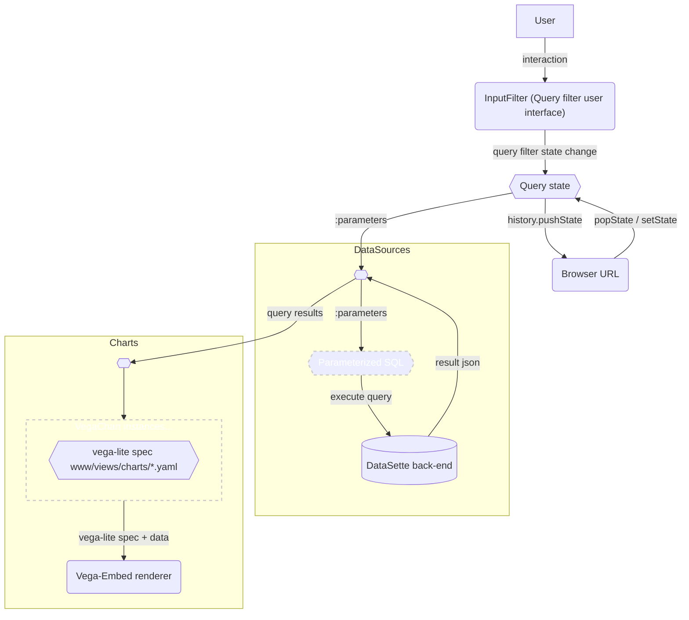

# Data³ Dashboards


Dashboards in Data³ are built in html by web-components implementing a few custom html elemeents.

The dashboard UI consists of a query form across the top of the page which is the primary navigation element. Editing any of the query fields will change state which is kept in the url and in the javascript code that implements the reactive application.

## Application Structure


A good place to start understanding the application is with an overview of the key components and their roles:

The dashboard page is built from the view template in [dashboard.html](../www/templates/views/dashboard.html)
* Most of the application is implemented in typescript which is compiled into javascript and then rolled up into a single app.js file called `static/app.js`.
* The application is loaded by `require.js` which is called from a script tag in dashboard.html.
* Once app.js is loaded the custom elements are bound to their javascript implementations and the components initialize in the order which they are referenced in the `initApp()` function in [DashboardApp.ts](../www/static/DashboardApp.ts)
* DashboardApp.ts - the "main" entrypoint for the application. Deals with initializing the application and facilitates coordination between the other components.
* The navigation ui is implemented by classes in filter-input.ts, specifically  `AutocompleteFilter` and `DaterangeFilter`.
* The dashboard charts are implemented by passing a vega lite spec to vega-embed which is wrapped by the web component class named `VegaChart`. See [vega-tonic.ts](../www/static/vega-tonic.ts).
* The data for the charts is provided by DataSource instances.
** Each DataSource is defined with a sql query template.
** The query can contain :placeholders which are filled in at runtime with the values from corresponding url query parameters.
** When the url state changes, any data DataSource which references the changed variable will be notified to update.
** Each affected DataSource will then fetch fresh json from the back-end database. When finished fetching data, then dependent charts are notified to update and provided with the new data.

---
I've attempted to describe the application state and control flow with the following diagram:

### State Flowchart




### Dashboard Web Components

Best told by example, here is how a dashboard is constructed. This is a simplified version of `www/templates/views/dashboard.html` with the jinja template constructs mostly removed for clarity.

CSS classes are mostly from the bootstrap css framework.
```html
<dashboard-app id='dashboard'>

  <data-source id='dashboard-queries'>
    <!-- a static-data-set is static in the sense that it doesn't depend on the query and is effectively immutable at runtime. Therefore, the data can be cached fairly aggressively. -->
    <static-data-set id='ds-project_tree' url="{{base_url}}metrics/project_tree.json?_shape=objects&_size=max&_ttl=86400"></static-data-set>
    <static-data-set id='ds-tasks' url="{{base_url}}metrics.json?_shape=objects" sql="select id,name,status,dateCreated,dateModified,subtype,points,priority,ownerPHID,closerPHID,dateClosed from Task where id in (?*)"></static-data-set>
    <!-- a data-set, without the static- prefix is dynamic in the sense that it is reactive, the data changes and views update based on changes to the user's query. -->
    <data-set db='metrics', id='ds-cycletime' params='project,date_start,date_end' url="{{base_url}}-/ddd/cycletime.json?"></data-set>
  </data-source>


  <!-- search / filter UI -->
  <form id='form_{{id}}'>
    <div class="container-fluid p-0 dashboard-filters">
      <autocomplete-filter id='project'></autocomplete-filter>
      <input-filter id='task_id' label='Task' style='display:none'></input-filter>
      <input-filter id='column' label='Column' style='display:none'></input-filter>
      <daterange-filter id='date'></daterange-filter>
      <div id="filter-group-buttons" class="col-sm-1 align-self-center align-items-center col-auto">
        <input type="submit" value="Update" class="button">
      </div>
    </div>
  </form>

  <!-- tabs -->
  <nav-tabs id='tabs' selected='columns'>
    <!-- one tab-item for each dashboard tab -->
    <tab-item role='tabpanel' id='{{tabid}}' value=1 class='active' label='{{tab.label}}'>
      <!-- one or more chart elements -->
      <vega-chart data-source='datasource-id' id='vega-chart-{{id}}' charttitle="title string" order="1">
        <script type='template' id='vega-spec-{{id}}'>{{chart.display|tojson}}</script>
      </vega-chart>
    </tab-item>
  </nav-tabs>

</dashboard-app>
<task-dialog id='task-modal'></task-dialog>

```

-----

## Adding new charts to the dashboard:

To add a new chart it's probably easiest to start from an existing example.  A good starting point would be [leadtime.yaml](www/templates/views/charts/leadtime.yaml). So start by making a copy of leadtime.yaml under a different name.

The yaml structure controls the positioning of the chart as well as the vega spec which maps query columns to axes on the chart.

### Example:
-----
```yaml
# The first part of the yaml defines the name of the chart,
# the database ("metrics.db") and the query name that will be
# used to get the data for the chart.
title: Lead & Cycle Time Histogram
db: metrics
tab: charts
order: 4    # the order of the chart, relative to other
            # charts on the page.
query: cycletime # the name of the query, this will read the
                 # query's sql definition from a file called
                 # cycletime.sql
type: vega       # this tells dashboard to use the vega-embed
                 # library to render the chart.
# Everything within the display section defines a
# vega-lite specification. vega-lite is normally specified in
# json format and to satisfy the vega compiler we produce json. # This yaml is directly converted to json by
# parsing with the python yaml parser and then encoding the
# resulting structure using the python json encoder.
display:
  # example vega-lite view specification formatted as yaml:
  width: 400
  height: 300
  mark:
    type: bar
    tooltip: true
  encoding:
    x:
      field: duration
      type: ordinal
      bin:
        maxbins: 20
      title: Cycle time (days, binned)
    y:
      aggregate: count
      title: Count of tasks
    color:
      field: duration
      scale:
        scheme: browns
      legend: null
```
-----
To learn more about the vega view specification language you can read about it in the [vega-lite documentation](https://vega.github.io/vega-lite/docs/spec.html) or browse some [examples](https://vega.github.io/vega-lite/examples/).